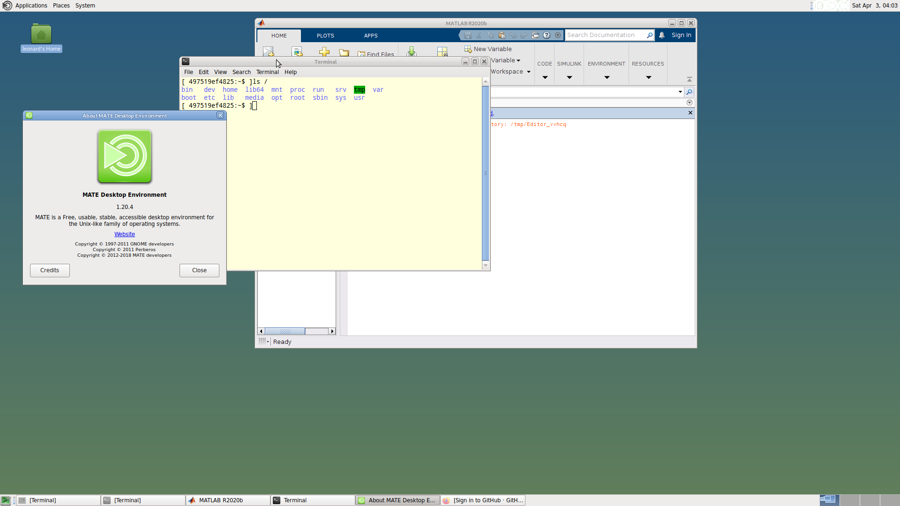

# Linux Developers Environment

## versions

- `v1`： debian without vnc
- `v2`： debian with vnc （Mate desktop Environment）

## features

-  toolchains for Linux developer

## Usage

####  v1 version

- `ROOTPASSWORD `:   change root password,defalut is `admin`
- `USER`:  add normal user  default is blank,if not define , docker default user is root
- `PASSWORD`:  USERS's Password,default is `admin`
- `ADDPATH`:   custom extra PATH

#### v2 version

- `ROOTPASSWORD` :   change root password,defalut is `admin`
- `USER`:  add normal user  default is blank,if not define , docker default user is root
- `PASSWORD`:  USERS's Password,default is `admin`
- `ADDPATH`:   custom extra PATH
- `VNC_PASSWORD`:  VNC password for VNC client，default is `admin1234`
- `RESOLUTION`:  VNC geometry :  '1920x1080',  required 
